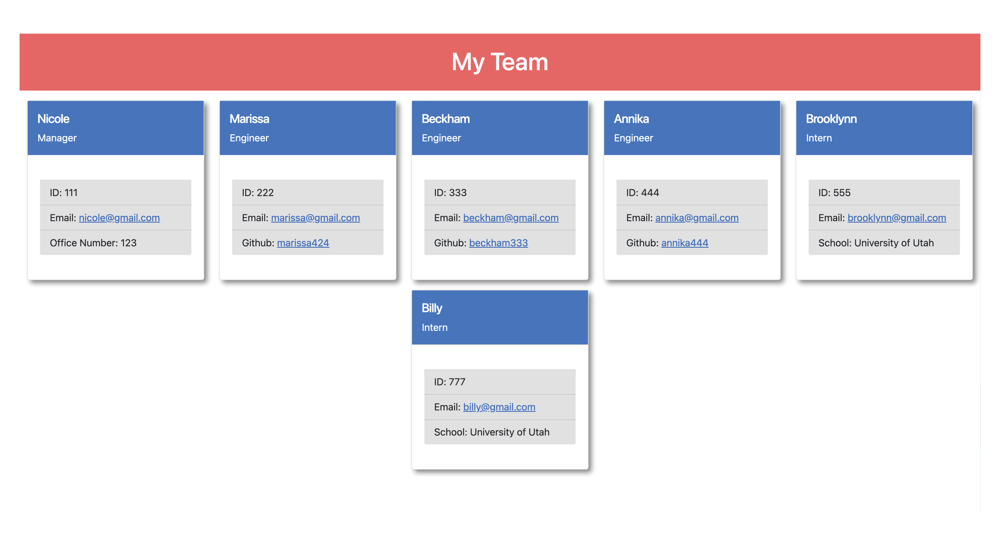
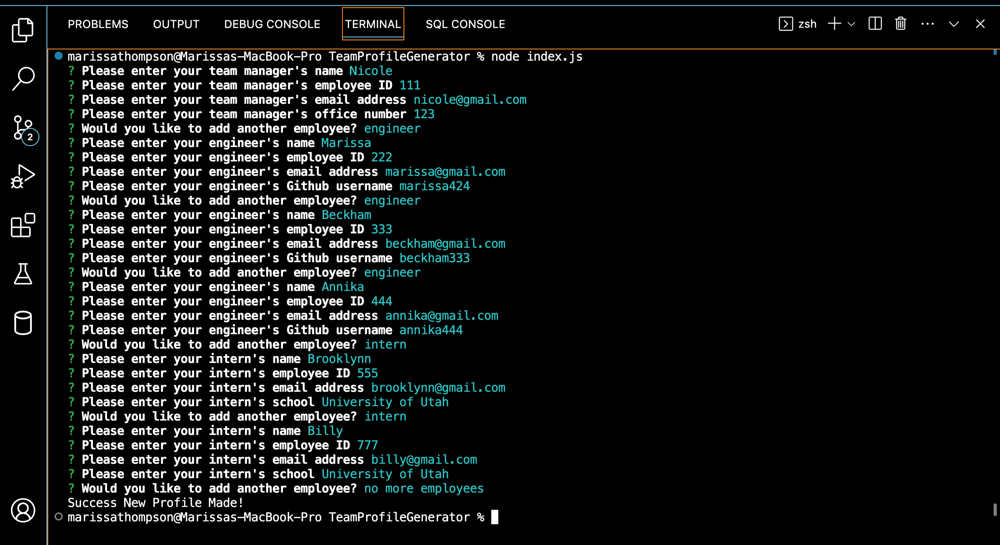

# Team Profile Generator

## Description
This is built using Node.js and is a command-line application that takes in information about employees on a software engineering team and generates an HTML webpage that displays summaries for each employee.

## Table of Contents
- [Installation](#installation)
- [Usage](#usage)
- [Credits](#credits)
- [License](#license)

## Installation
To install this project clone the code from the GitHub repository to your local system. You will need to make sure you have nodeJS installed before running this application. Once you have cloned the repo succesfully, open the integrated terminal in your index.js file and run nmp i to install the required dependencises.

## Usage
Once you have installed nodeJS and the required dependencises you can run node index.js in your terminal to start the application. You will be prompted with a series of questions to answer. You will first enter the managers information and from there you will be able to add a engineer profile or a intern profile. Once you have added in all the employee's you would like you will select no more employee's and your html file will be created. From there you can open your html file in your browser to view your team proile page. 

* To view a video walk through of this application use the following link: https://drive.google.com/file/d/16hVyqJKIrthWRyHHbtYBiIe8hlfk54U3/view

## Application Demo and Screenshot
DEMO

TEAM PROFILE

TERMINAL DISPLAY OF PROMPTED QUESTIONS

## Credits
* Coursework from Coding Boot Camp module 10 referenced for additional guidance.

## Tests
To run test open your intergrated terminal and run npm run test in the command line

## License
This repository is licensed under the [MIT license](https://choosealicense.com/licenses/mit/).

---

## Badges

## How to Contribute
  To suggest an idea or report a bug, please create an issue. Or, submit a pull request from your fork to the original repository for review.